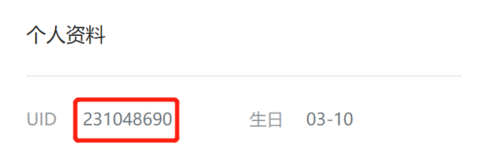
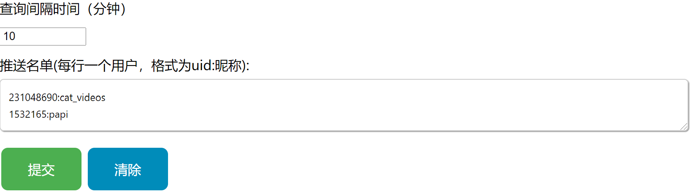

# bilibili-notification-chrome-extension
_🔈当列表中的人发动态时会弹出消息提醒你的chrome插件🔈_

## 使用指南

1. 找到你想要接收推送的up主的uid

2. 在插件选项中设置查询间隔时间和推送名单。推送名单中uid和昵称要用英文冒号分开。

## 原理
每间隔一段时间向b站服务器查询列表中up主的动态有无更新

---

Icons made by <a href="https://www.flaticon.com/authors/hight-quality-icons" title="Hight Quality Icons">Hight Quality Icons</a> from <a href="https://www.flaticon.com/" title="Flaticon">www.flaticon.com</a>
